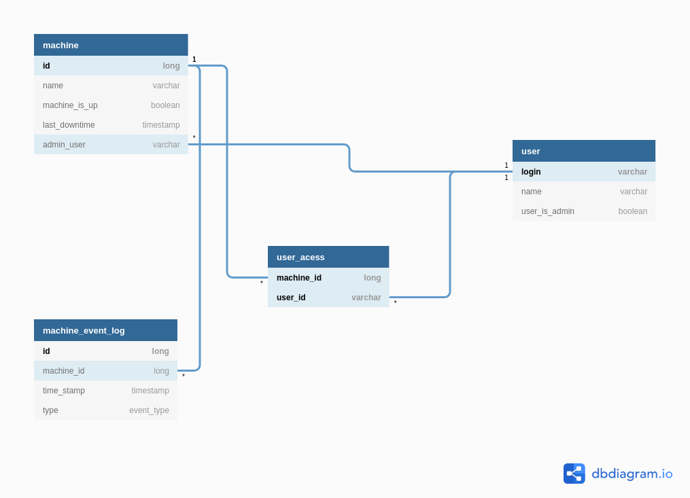

# Machine Monitor System

Application responsible for monitoring the usage of a group of computers, recording any downtime of the machines.
The system also manages the creation of machines and users, and granting users acess to the machines.

This repository holds both Frontend (in the app folder) and Backend (in the src folder) of the application. The Backend
REST API was constructed using the **SpringBoot** framework, and the Frontend using the **React.js** library.  

## Getting started

### Dependencies

To run the application, install the lastest versions (except Java, which must be version 8) 
of the following applications:

- [Java 8](https://www.java.com/pt_BR/download/)
- [Maven](https://maven.apache.org/)
- [Node.js](https://nodejs.org/en/)
- [Yarn](https://yarnpkg.com/)

### Building

Maven is used to build the backend SpringBoot API, running the following command:

`mvn package`

### Testing 

The SpringBoot API was tested using JUnit, to execute the tests run:

`mvn test`

### Running 

To run the backend SpringBoot API, run:

 `mvn spring-boot:run`
 
To run the React.js client, enter the app folder and run:

`yarn start`

You can acess the application in a web browser via the URL `http://localhost:3000`. Following Figure shows the Home 
page of the application.

## Definitions

Explicar rapidamente a modelagem, e citar o uso do H2

## Usage

Explicar brevemente o que pode ser feito no sistema (usar prints)