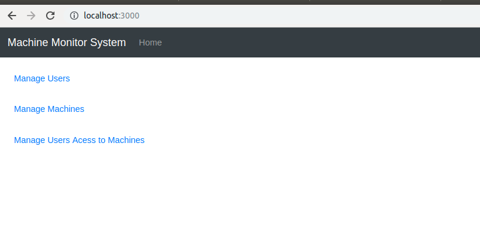

# Machine Monitor System

Application responsible for monitoring the usage of a group of computers, recording any downtime of the machines.
The system also manages the creation of machines and users, and granting users acess to the machines.

This repository holds both Frontend (in the app folder) and Backend (in the src folder) of the application. The Backend
REST API was constructed using the **SpringBoot** framework, and the Frontend using the **React.js** library.  

## Getting started

### Dependencies

To run the application, install the lastest versions (except Java, wich must be version 8) 
of the following applications:

- [Java 8](https://www.java.com/pt_BR/download/)
- [Maven](https://maven.apache.org/)
- [Node.js](https://nodejs.org/en/)
- [Yarn](https://yarnpkg.com/)

### Building

Maven is used to build the backend SpringBoot API, running the following command:

`mvn package`

### Testing 

The SpringBoot API was tested using JUnit, to execute the tests run:

`mvn test`

### Running 

To run the backend SpringBoot API, run:

 `mvn spring-boot:run`
 
To run the React.js client, enter the app folder and run:

`yarn start`

You can acess the application in a web browser via the URL `http://localhost:3000`. Following Figure shows the Home 
page of the application.

## Context

The application processes stream data coming from `stdin` representing operations on an Account.
The program handles two kinds of operations, deciding on which one according to the line that is being processed:

1.  Account creation
2.  Transaction authorization

Operation data is provided as JSON strings as follows:

1. Account creation:

{"account": {"active-card": true, "available-limit": 100}}

2. Transaction authorization:

{"transaction": {"merchant": "Burger King", "amount": 20, "time": "2019-02-13T10:00:00.000Z"}}

For each operation provided, the application verifies if it breaks any of the following bussines rules:

* There's already an account registered on the system. (Account creation)
* There is no account registered on the system. (Transaction authorization)
* The card on the account is not active.
* The transaction amount does not exceed account's available limit.
* There isn't more than 3 transactions on a 2 minute interval.
* There isn't more than 1 similar transactions (same amount and merchant) in a 2 minutes interval.

If an operation breaks any of the rules, it's not applied to the account. Otherwise, the state of the account 
is changed, reducing it's available limit. The output of the application is a JSON string of the format:

{"account": {"active-card": true, "available-limit": 100}, "violations": \["account-already-initialized"\]}

## Architecture

The application uses the concepts of Event-Driven Architecture and Event-Sourcing. It **reacts** to events coming from 
the input stream, enqueing those events before performing changes on the state of the Account. This way, it's possible 
to **return the Account to it's current state** in case of failures, just by reprocessing the events on the queue.

Following figure shows the interactions between each component of the system.

Stream data from `stdin` is readed in the main AuthorizerApplication, which instantiates an EventProcessor. The EventProcessor
parses the inputString, identifies the type of event (either an AccountCreationEvent or TransactionAuthorizationEvent),
and calls the event process method. Each event verifies if there is an Account registered on the system, and check for
violations. If there is no violation of Account initiation rules, the correct event handler method on the Account class
is called, based on event type. **Account and Transaction** entities were implemented as **Domain objects**, which means that
they know how to process events and change their state based on that event, so business logic methods are implemented on them.
If an Account find any violation to the business rules, they're returned to the events, which creates the correct 
OutputModel object, printed on the `stdout` by the EventProcessor.

### Important Notes

* Each time the current state of the account is queried, a copy of the account is returned instead of the account itself.
I did it that way to make the **Account immutable**.

* The Account stores all the transactions on a **TreeSet Data Structure**. The TreeSet class allows **sorted insertion** of data.
This is useful to keep account transactions ordered by time.

## Tests

* Unit Tests were implemented using JUnit.
* Integration testing was done by populating a InputStream with data, executing the main method of the AuthorizerApplication
class, and checking data being printed on `stdout`.
* Event-Sourcing recover was tested on EventProcessorTest class, method testingEventSourcingReprocessingMechanism.

### Running

Tests are runned on application build, but they can be executed using `mvn test` command.